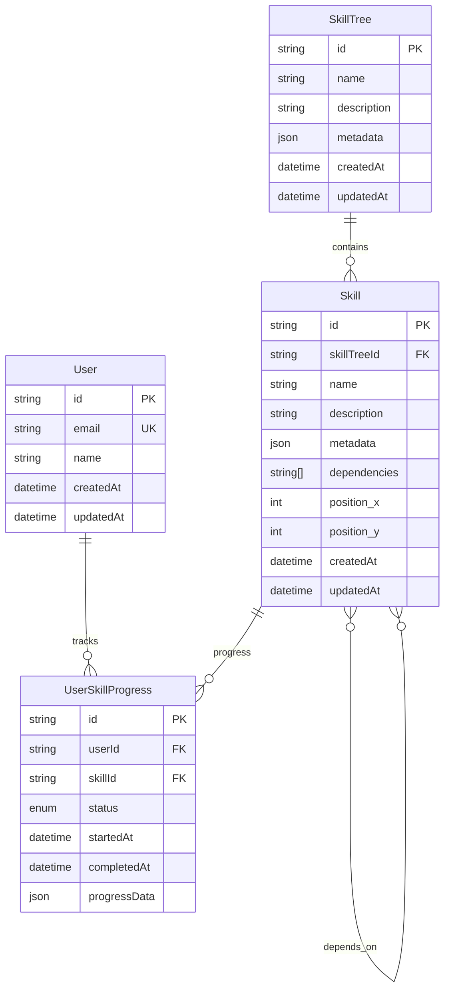

# ADR-003: Database and ORM Selection

**Status**: Accepted
**Date**: 2025-09-13
**Decision Makers**: Software Architect, Product Owner
**Consulted**: Development Team
**Informed**: All Stakeholders

## Context

SkillTree requires a database solution that can efficiently handle:

- **Complex Relationships**: Skill dependencies forming directed acyclic graphs (DAGs)
- **User Progress**: Tracking individual progress through skill trees
- **Scalable Queries**: Fast retrieval of skill tree structures and user data
- **ACID Compliance**: Consistent data for critical user progress and achievements
- **Type Safety**: Strong integration with TypeScript backend
- **Migration Support**: Schema evolution as skill trees become more complex

## Decision

We will use **PostgreSQL 15+ with Prisma ORM** for our database and data access layer.

### Selected Technologies:

- **Database**: PostgreSQL 15.x (with advanced indexing and JSON support)
- **ORM**: Prisma 5.x (type-safe database toolkit)
- **Migration System**: Prisma Migrate for schema versioning
- **Connection Pooling**: PgBouncer for production connection management
- **Development**: Docker PostgreSQL for consistent dev environment

## Options Considered

### Database Systems
| Option | Pros | Cons | Decision |
|--------|------|------|----------|
| **PostgreSQL** ✅ | • Excellent JSON/JSONB support<br>• Advanced indexing (GIN, GiST)<br>• Strong ACID compliance<br>• Rich extension ecosystem<br>• Recursive query support (CTEs) | • Single-node limitations<br>• Complex setup for clustering | **SELECTED** |
| MongoDB | • Document model flexibility<br>• Horizontal scaling<br>• JSON-native storage | • Weak consistency model<br>• Complex relationship queries<br>• Limited transaction support | Rejected |
| Neo4j | • Native graph database<br>• Optimized for relationships<br>• Cypher query language | • Specialized use case<br>• Limited general queries<br>• Learning curve | Rejected |

### ORM/Query Builder Options
| Option | Pros | Cons | Decision |
|--------|------|------|----------|
| **Prisma** ✅ | • Type-safe generated client<br>• Excellent migration system<br>• Database introspection<br>• Great TypeScript integration<br>• Visual database browser | • Query limitations vs raw SQL<br>• Learning curve<br>• Generated client overhead | **SELECTED** |
| TypeORM | • Decorator-based entities<br>• Active Record pattern<br>• Multiple database support<br>• Mature ecosystem | • Complex configuration<br>• Performance overhead<br>• Migration complexity | Rejected |
| Knex.js | • Lightweight query builder<br>• SQL-first approach<br>• Migration support<br>• High performance | • No type safety<br>• Manual relationship handling<br>• Verbose queries | Rejected |

## Rationale

### Why PostgreSQL?
1. **Graph-Friendly Features**: Recursive CTEs perfect for skill tree traversal
2. **JSON/JSONB Support**: Flexible storage for dynamic skill metadata
3. **Advanced Indexing**: GIN indexes on JSON fields, partial indexes for performance
4. **ACID Compliance**: Critical for user progress and achievement consistency
5. **Extension Ecosystem**: Future-ready with extensions like PostGIS, pg_trgm

### Why Prisma ORM?
1. **Type Safety**: Generated client provides compile-time query validation
2. **Developer Experience**: Database introspection and migration previews
3. **Schema-First**: Clear data modeling with automatic TypeScript generation
4. **Migration System**: Version-controlled, reversible schema migrations
5. **Performance Features**: Connection pooling, query optimization, relation loading

### PostgreSQL for Skill Trees
```sql
-- Recursive CTE example for skill dependencies
WITH RECURSIVE skill_path AS (
  SELECT id, name, dependencies, 1 as level
  FROM skills
  WHERE id = $1

  UNION ALL

  SELECT s.id, s.name, s.dependencies, sp.level + 1
  FROM skills s
  JOIN skill_path sp ON s.id = ANY(sp.dependencies)
  WHERE sp.level < 10 -- Prevent infinite recursion
)
SELECT * FROM skill_path ORDER BY level;
```

### Prisma Schema Benefits
```prisma
model User {
  id        String   @id @default(cuid())
  email     String   @unique
  progress  UserSkillProgress[]
  createdAt DateTime @default(now())
  updatedAt DateTime @updatedAt
}

model Skill {
  id           String   @id @default(cuid())
  name         String
  description  String?
  metadata     Json?    // Flexible JSON storage
  dependencies String[] // Array of skill IDs
  userProgress UserSkillProgress[]

  @@index([dependencies], type: Gin) // GIN index for array queries
}

model UserSkillProgress {
  id           String   @id @default(cuid())
  userId       String
  skillId      String
  status       SkillStatus
  completedAt  DateTime?

  user         User     @relation(fields: [userId], references: [id])
  skill        Skill    @relation(fields: [skillId], references: [id])

  @@unique([userId, skillId])
  @@index([userId, status]) // Compound index for user queries
}
```

## Consequences

### Positive
- **Type Safety**: End-to-end type safety from database to API
- **Performance**: Optimized queries with proper indexing strategies
- **Developer Experience**: Visual database browser and migration previews
- **Scalability**: PostgreSQL handles complex queries efficiently
- **Consistency**: ACID transactions ensure data integrity

### Negative
- **Complexity**: Additional abstraction layer over raw SQL
- **Learning Curve**: Team needs to learn Prisma conventions
- **Query Limitations**: Some advanced PostgreSQL features require raw SQL

### Risks and Mitigation
- **Risk**: Prisma performance overhead vs raw queries
  - **Mitigation**: Profile queries and use raw SQL for critical paths
- **Risk**: PostgreSQL single-node scaling limits
  - **Mitigation**: Read replicas and connection pooling, future sharding options
- **Risk**: Migration complexity as schema evolves
  - **Mitigation**: Comprehensive migration testing and rollback procedures

## Database Schema Design

### Core Entities


### Indexing Strategy
- **Primary Keys**: CUID-based for distributed-friendly IDs
- **User Queries**: Compound indexes on (userId, status) for progress queries
- **Skill Dependencies**: GIN indexes on dependency arrays
- **Search**: Full-text search indexes on skill names and descriptions
- **Performance**: Partial indexes for active/completed skills only

## Performance Optimization

### Query Patterns
1. **Skill Tree Loading**: Single query with proper JOIN and WHERE clauses
2. **User Progress**: Efficient filtering with compound indexes
3. **Dependency Traversal**: Recursive CTEs for prerequisite checking
4. **Search Operations**: Full-text search with proper indexes
5. **Batch Operations**: Transaction batching for bulk updates

### Connection Management
- **Development**: Direct connections with reasonable pool size
- **Production**: PgBouncer for connection pooling and load balancing
- **Monitoring**: Query performance tracking and slow query identification
- **Caching**: Redis integration for frequently accessed skill trees

## Data Integrity

### Constraints
- **Referential Integrity**: Foreign key constraints on all relationships
- **Check Constraints**: Validation for skill status transitions
- **Unique Constraints**: Prevent duplicate user progress records
- **Not Null**: Critical fields marked as required

### Transaction Patterns
- **Progress Updates**: Atomic updates for user skill completion
- **Skill Tree Creation**: Transactional skill and dependency creation
- **User Registration**: Atomic user creation with initial progress setup
- **Bulk Operations**: Proper transaction boundaries for large updates

## Migration Strategy

### Development Workflow
```bash
# Schema changes
npx prisma db push          # Development schema sync
npx prisma migrate dev      # Create development migration
npx prisma generate         # Regenerate client

# Production deployment
npx prisma migrate deploy   # Apply migrations
npx prisma generate         # Update client
```

### Migration Best Practices
- **Backward Compatibility**: Migrations that don't break existing API
- **Data Preservation**: Safe migrations that preserve user progress
- **Rollback Strategy**: All migrations tested with rollback procedures
- **Performance**: Large table migrations planned during maintenance windows

## Implementation Plan

### Phase 1: Core Schema (Week 2)
- [ ] Set up PostgreSQL development environment with Docker
- [ ] Design initial Prisma schema for users, skills, and progress
- [ ] Implement basic CRUD operations with type safety
- [ ] Create development seed data for testing
- [ ] Set up migration workflow and best practices

### Phase 2: Advanced Features (Week 3)
- [ ] Implement skill dependency validation and queries
- [ ] Add full-text search capabilities for skills
- [ ] Optimize query performance with proper indexing
- [ ] Create database backup and recovery procedures
- [ ] Add query monitoring and performance metrics

### Phase 3: Production Readiness (Week 4)
- [ ] Set up PgBouncer for connection pooling
- [ ] Configure production database with proper security
- [ ] Implement comprehensive migration testing
- [ ] Add database monitoring and alerting
- [ ] Create disaster recovery procedures

## Monitoring and Maintenance

### Performance Monitoring
- **Query Performance**: Track slow queries and optimization opportunities
- **Index Usage**: Monitor index effectiveness and missing index detection
- **Connection Pooling**: Track connection usage and pool efficiency
- **Storage Growth**: Monitor database size and plan capacity

### Maintenance Tasks
- **Regular Backups**: Automated daily backups with point-in-time recovery
- **Index Maintenance**: Regular REINDEX and ANALYZE operations
- **Statistics Updates**: Keep query planner statistics current
- **Log Analysis**: Regular review of PostgreSQL logs for issues

---

**Decision Status**: ✅ **APPROVED** by Product Owner on 2025-09-13
**Next Review**: Sprint 2 (Week 4) - Performance analysis and scaling assessment
**Related ADRs**: ADR-002 (Backend), ADR-004 (Authentication), ADR-005 (Visualization)