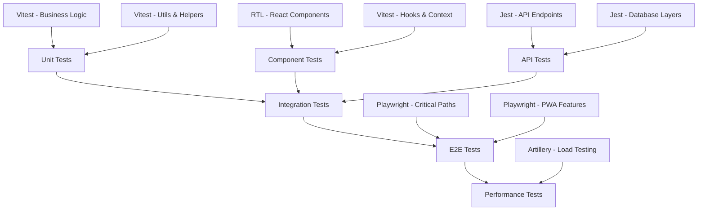

# ADR-006: Testing Strategy and Tools

**Status**: Accepted
**Date**: 2025-09-13
**Decision Makers**: Software Architect, Product Owner
**Consulted**: Development Team, QA Process Review
**Informed**: All Stakeholders

## Context

SkillTree requires a comprehensive testing strategy to ensure:

- **Code Quality**: High test coverage for critical business logic
- **User Experience**: Reliable UI components and user interactions
- **API Reliability**: Robust backend API testing with various scenarios
- **Regression Prevention**: Automated testing to prevent feature breakage
- **Performance Validation**: Load testing for scalability requirements
- **PWA Functionality**: Service worker and offline capability testing

## Decision

We will implement a **multi-layered testing strategy** using **Vitest (frontend) + Jest (backend)** as our primary testing tools.

### Selected Testing Stack:

- **Frontend Testing**: Vitest + React Testing Library + jsdom
- **Backend Testing**: Jest + Supertest for API testing
- **E2E Testing**: Playwright for critical user journeys
- **Performance Testing**: Artillery.js for load testing
- **Coverage**: 80%+ code coverage requirement across all layers

## Options Considered

### Frontend Testing Frameworks
| Option | Pros | Cons | Decision |
|--------|------|------|----------|
| **Vitest** ✅ | • Vite-native integration<br>• Ultra-fast test execution<br>• ESM support<br>• Compatible with Jest API<br>• TypeScript first-class | • Newer ecosystem<br>• Less mature than Jest<br>• Fewer plugins | **SELECTED** |
| Jest | • Mature, battle-tested<br>• Rich ecosystem<br>• Excellent mocking<br>• Snapshot testing | • Slower with Vite<br>• ESM configuration complexity<br>• Build tool friction | Rejected |
| Cypress Component | • Real browser testing<br>• Excellent debugging<br>• Visual testing | • Slower execution<br>• Complex setup<br>• Overkill for unit tests | Rejected |

### Backend Testing Frameworks
| Option | Pros | Cons | Decision |
|--------|------|------|----------|
| **Jest** ✅ | • Node.js standard<br>• Excellent mocking capabilities<br>• Great TypeScript support<br>• Rich assertion library<br>• Snapshot testing | • Can be slower for large suites<br>• Memory usage concerns | **SELECTED** |
| Mocha + Chai | • Flexible, modular<br>• BDD/TDD support<br>• Lightweight core | • More configuration required<br>• Less integrated experience<br>• Setup complexity | Rejected |
| Node.js Test Runner | • Built into Node.js<br>• Zero dependencies<br>• Fast execution | • Limited features<br>• No mocking built-in<br>• Minimal assertion library | Rejected |

### E2E Testing Solutions
| Option | Pros | Cons | Decision |
|--------|------|------|----------|
| **Playwright** ✅ | • Multi-browser support<br>• Excellent mobile testing<br>• Built-in waiting<br>• Video/screenshot capture<br>• TypeScript native | • Learning curve<br>• Resource intensive<br>• Newer than alternatives | **SELECTED** |
| Cypress | • Great developer experience<br>• Time-travel debugging<br>• Rich ecosystem<br>• Visual testing | • Single browser historically<br>• Complex iframe handling<br>• Network stubbing limitations | Rejected |
| Selenium | • Industry standard<br>• Multi-language support<br>• Mature ecosystem | • Flaky tests common<br>• Complex setup<br>• Slow execution | Rejected |

## Rationale

### Why Vitest for Frontend?
1. **Vite Integration**: Native Vite support eliminates build configuration issues
2. **Performance**: Significantly faster than Jest with Vite projects
3. **ESM Native**: Handles modern JavaScript modules without configuration
4. **Development Experience**: Watch mode, hot reload, instant feedback
5. **API Compatibility**: Drop-in replacement for Jest API

### Why Jest for Backend?
1. **Maturity**: Battle-tested in Node.js ecosystem
2. **Mocking**: Powerful mocking capabilities for database and external services
3. **TypeScript**: Excellent TypeScript integration with ts-jest
4. **Fastify Testing**: Great integration with Fastify testing utilities
5. **Coverage**: Built-in code coverage reporting

### Why Playwright for E2E?
1. **Multi-Browser**: Chrome, Firefox, Safari, and mobile browsers
2. **Reliability**: Built-in waiting and retry mechanisms
3. **PWA Testing**: Excellent support for service workers and offline testing
4. **Mobile Testing**: Native mobile viewport and touch simulation
5. **TypeScript**: First-class TypeScript support

## Testing Strategy Architecture



## Implementation Details

### Frontend Testing Setup (Vitest)
```typescript
// vitest.config.ts
import { defineConfig } from 'vitest/config';
import react from '@vitejs/plugin-react';

export default defineConfig({
  plugins: [react()],
  test: {
    environment: 'jsdom',
    globals: true,
    setupFiles: ['./src/test/setup.ts'],
    coverage: {
      reporter: ['text', 'json', 'html'],
      threshold: {
        global: {
          branches: 80,
          functions: 80,
          lines: 80,
          statements: 80
        }
      }
    }
  }
});

// Component testing example
import { render, screen, fireEvent } from '@testing-library/react';
import { describe, it, expect, vi } from 'vitest';
import { SkillNode } from '../components/SkillNode';

describe('SkillNode Component', () => {
  it('renders skill information correctly', () => {
    const skill = {
      id: 'test-skill',
      name: 'Test Skill',
      status: 'available'
    };

    render(<SkillNode skill={skill} onClick={vi.fn()} />);

    expect(screen.getByText('Test Skill')).toBeInTheDocument();
    expect(screen.getByRole('button')).toHaveClass('skill-available');
  });

  it('handles click events', async () => {
    const onClick = vi.fn();
    const skill = { id: 'test', name: 'Test', status: 'available' };

    render(<SkillNode skill={skill} onClick={onClick} />);

    fireEvent.click(screen.getByRole('button'));
    expect(onClick).toHaveBeenCalledWith('test');
  });
});
```

### Backend Testing Setup (Jest)
```typescript
// jest.config.js
module.exports = {
  preset: 'ts-jest',
  testEnvironment: 'node',
  setupFilesAfterEnv: ['<rootDir>/src/test/setup.ts'],
  collectCoverageFrom: [
    'src/**/*.{ts,js}',
    '!src/**/*.d.ts',
    '!src/test/**/*'
  ],
  coverageThreshold: {
    global: {
      branches: 80,
      functions: 80,
      lines: 80,
      statements: 80
    }
  }
};

// API testing example
import { build } from '../app';
import { FastifyInstance } from 'fastify';

describe('Authentication API', () => {
  let app: FastifyInstance;

  beforeAll(async () => {
    app = build({ logger: false });
    await app.ready();
  });

  afterAll(async () => {
    await app.close();
  });

  describe('POST /api/v1/auth/login', () => {
    it('should authenticate valid user', async () => {
      const response = await app.inject({
        method: 'POST',
        url: '/api/v1/auth/login',
        payload: {
          email: 'test@example.com',
          password: 'validPassword123'
        }
      });

      expect(response.statusCode).toBe(200);
      expect(response.json()).toHaveProperty('accessToken');
      expect(response.cookies).toHaveLength(1); // refresh token
    });

    it('should reject invalid credentials', async () => {
      const response = await app.inject({
        method: 'POST',
        url: '/api/v1/auth/login',
        payload: {
          email: 'test@example.com',
          password: 'wrongPassword'
        }
      });

      expect(response.statusCode).toBe(401);
      expect(response.json()).toHaveProperty('error');
    });
  });
});
```

### E2E Testing Setup (Playwright)
```typescript
// playwright.config.ts
import { PlaywrightTestConfig } from '@playwright/test';

const config: PlaywrightTestConfig = {
  testDir: './e2e',
  timeout: 30000,
  use: {
    baseURL: 'http://localhost:5173',
    headless: true,
    screenshot: 'only-on-failure',
    video: 'retain-on-failure',
  },
  projects: [
    { name: 'Desktop Chrome', use: { browserName: 'chromium' } },
    { name: 'Desktop Firefox', use: { browserName: 'firefox' } },
    { name: 'Mobile Safari', use: {
      browserName: 'webkit',
      viewport: { width: 375, height: 667 },
      isMobile: true
    }}
  ]
};

// E2E test example
import { test, expect } from '@playwright/test';

test.describe('Skill Tree Navigation', () => {
  test.beforeEach(async ({ page }) => {
    // Login user
    await page.goto('/login');
    await page.fill('[data-testid=email]', 'user@example.com');
    await page.fill('[data-testid=password]', 'password123');
    await page.click('[data-testid=login-button]');
    await expect(page).toHaveURL('/dashboard');
  });

  test('should display skill tree and allow navigation', async ({ page }) => {
    await page.goto('/skill-trees/programming');

    // Check skill tree renders
    await expect(page.locator('[data-testid=skill-tree]')).toBeVisible();

    // Click on available skill
    await page.click('[data-testid=skill-node-javascript-basics]');

    // Verify skill details modal opens
    await expect(page.locator('[data-testid=skill-modal]')).toBeVisible();
    await expect(page.locator('h2')).toContainText('JavaScript Basics');
  });

  test('should work offline after loading', async ({ page, context }) => {
    // Load skill tree
    await page.goto('/skill-trees/programming');
    await page.waitForLoadState('networkidle');

    // Go offline
    await context.setOffline(true);
    await page.reload();

    // Should still work from cache
    await expect(page.locator('[data-testid=skill-tree]')).toBeVisible();
  });
});
```

## Testing Coverage Strategy

### Unit Testing (70% of tests)
- **Business Logic**: Core skill tree algorithms, user progress calculations
- **Utility Functions**: Data transformations, validation helpers
- **React Hooks**: Custom hooks for state management and API calls
- **Database Models**: Prisma model validations and transformations

### Integration Testing (20% of tests)
- **API Endpoints**: Full request/response cycle testing
- **Database Integration**: Real database operations with test data
- **Service Layer**: Business logic integration with data layer
- **Authentication Flow**: Complete auth workflow testing

### E2E Testing (10% of tests)
- **Critical User Journeys**: Registration, login, skill tree exploration
- **PWA Functionality**: Offline mode, service worker updates
- **Cross-browser Compatibility**: Chrome, Firefox, Safari testing
- **Mobile Responsiveness**: Touch interactions, responsive layouts

## Performance Testing Strategy

### Load Testing with Artillery.js
```yaml
# artillery.yml
config:
  target: 'http://localhost:3000'
  phases:
    - duration: 60
      arrivalRate: 10
      name: "Warm up"
    - duration: 300
      arrivalRate: 50
      name: "Sustained load"
    - duration: 60
      arrivalRate: 100
      name: "Peak load"

scenarios:
  - name: "Skill Tree API Load"
    flow:
      - post:
          url: "/api/v1/auth/login"
          json:
            email: "load-test-user@example.com"
            password: "testPassword123"
      - get:
          url: "/api/v1/skill-trees/{{ $randomString() }}"
          headers:
            Authorization: "Bearer {{ accessToken }}"
```

### Performance Benchmarks
- **API Response Time**: < 100ms for skill tree queries
- **Frontend Render Time**: < 200ms for skill tree visualization
- **Bundle Size**: < 500KB initial load, < 100KB per route
- **Memory Usage**: < 100MB frontend, < 500MB backend
- **Concurrent Users**: 1000+ simultaneous users supported

## CI/CD Integration

### GitHub Actions Workflow
```yaml
name: Test Suite

on: [push, pull_request]

jobs:
  frontend-tests:
    runs-on: ubuntu-latest
    steps:
      - uses: actions/checkout@v3
      - uses: actions/setup-node@v3
        with:
          node-version: '18'
      - run: npm ci
      - run: npm run test:frontend
      - run: npm run test:coverage

  backend-tests:
    runs-on: ubuntu-latest
    services:
      postgres:
        image: postgres:15
        env:
          POSTGRES_PASSWORD: testpass
        options: >-
          --health-cmd pg_isready
          --health-interval 10s
          --health-timeout 5s
          --health-retries 5
    steps:
      - uses: actions/checkout@v3
      - uses: actions/setup-node@v3
      - run: npm ci
      - run: npm run test:backend
      - run: npm run test:integration

  e2e-tests:
    runs-on: ubuntu-latest
    steps:
      - uses: actions/checkout@v3
      - uses: actions/setup-node@v3
      - run: npm ci
      - run: npx playwright install
      - run: npm run build
      - run: npm run test:e2e
```

## Quality Gates

### Pre-commit Hooks
- **Linting**: ESLint and Prettier validation
- **Type Checking**: TypeScript compilation check
- **Unit Tests**: Fast unit tests must pass
- **Coverage**: Maintain minimum coverage thresholds

### Pull Request Requirements
- **All Tests Pass**: Unit, integration, and component tests
- **Coverage Maintained**: No decrease in code coverage
- **E2E Tests**: Critical path tests pass
- **Performance**: No regression in key performance metrics

### Production Deployment Gates
- **Full Test Suite**: All test types must pass
- **Load Testing**: Performance benchmarks met
- **Security Scan**: No high-severity vulnerabilities
- **Smoke Tests**: Post-deployment verification

## Implementation Plan

### Phase 1: Foundation (Week 2)
- [ ] Set up Vitest with React Testing Library
- [ ] Configure Jest for backend API testing
- [ ] Establish test database and data seeding
- [ ] Create initial test utilities and helpers
- [ ] Set up code coverage reporting

### Phase 2: Core Testing (Week 2-3)
- [ ] Write unit tests for business logic
- [ ] Create component tests for React components
- [ ] Add API endpoint integration tests
- [ ] Implement authentication flow testing
- [ ] Set up continuous integration pipeline

### Phase 3: E2E and Performance (Week 3-4)
- [ ] Configure Playwright for E2E testing
- [ ] Create critical user journey tests
- [ ] Add PWA and offline functionality tests
- [ ] Set up Artillery.js for load testing
- [ ] Implement performance monitoring

### Phase 4: Quality Assurance (Week 4-5)
- [ ] Achieve 80%+ code coverage across all layers
- [ ] Add visual regression testing capabilities
- [ ] Create comprehensive test documentation
- [ ] Set up test result reporting and metrics
- [ ] Establish testing best practices guide

## Monitoring and Metrics

### Test Metrics Tracking
- **Coverage Reports**: Lines, branches, functions coverage
- **Test Execution Time**: Monitor for performance regressions
- **Flaky Test Detection**: Identify and fix unreliable tests
- **Test Suite Health**: Overall pass rates and stability

### Quality Metrics
- **Bug Escape Rate**: Production bugs that passed testing
- **Test Effectiveness**: Tests that catch real issues
- **Developer Productivity**: Time saved by automated testing
- **Deployment Confidence**: Successful deployments with full test coverage

---

**Decision Status**: ✅ **APPROVED** by Product Owner on 2025-09-13
**Next Review**: Sprint 2 (Week 4) - Test coverage and effectiveness assessment
**Related ADRs**: ADR-001 (Frontend), ADR-002 (Backend), ADR-007 (API Documentation)